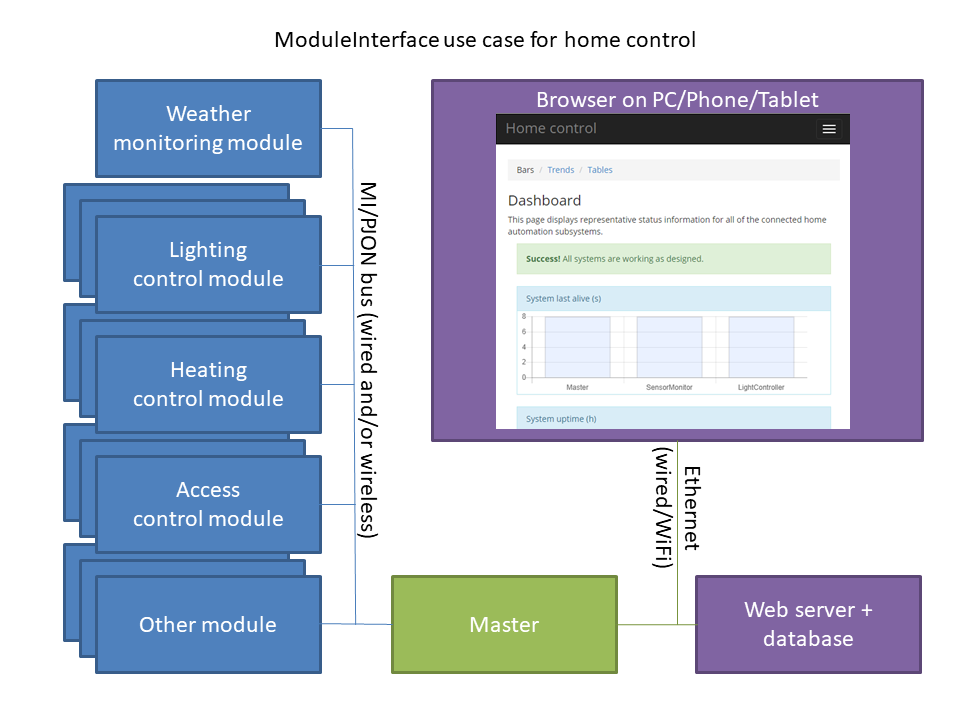
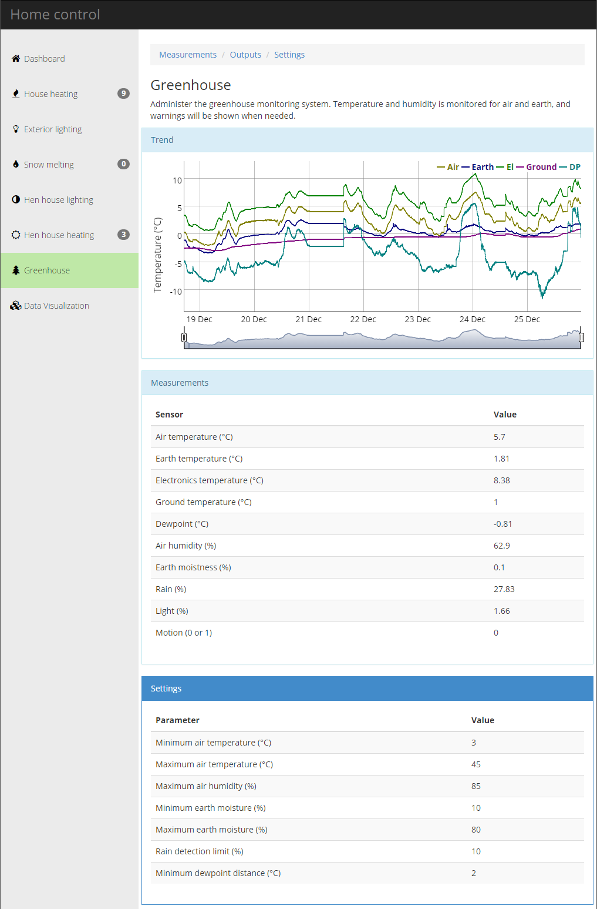

# ModuleInterface v4.1

**_New in v4.1_**
- Support for using _only_ MQTT instead of HTTP. This means that the master can be a gateway to and from external automation systems like Home Assistant / Node Red without setting up the ModuleInterface web site, web server and database. The hybrid mode with both HTTP and MQTT is still the recommended mode, utilizing the web pages and plotting plus external automation systems working together in both directions.
- [PulseView/sigrok](https://sigrok.org/wiki/Downloads) protocol decoders for ModuleInterface v4 and [PJON](https://github.com/gioblu/PJON) with [PJON SoftwareBitBang (SWBB)](https://github.com/gioblu/PJON/tree/master/src/strategies/SoftwareBitBang) based on PJON v13 are now available [here](https://github.com/fredilarsen/libsigrokdecode/tree/master/decoders/moduleinterface), [here](https://github.com/fredilarsen/libsigrokdecode/tree/master/decoders/pjon) and [here](https://github.com/fredilarsen/libsigrokdecode/tree/master/decoders/pjdl). Copy all 3 directories into `C:\Program Files\sigrok\PulseView\share\libsigrokdecode\decoders` or similar and restart PulseView. Example data dumps are available [here](https://github.com/fredilarsen/sigrok-dumps/tree/master/moduleinterface) and [here](https://github.com/fredilarsen/sigrok-dumps/tree/master/pjon). These have been logged with a simple $4 USB logic analyzer like [this](https://www.instructables.com/FX2LP-CY7C68013A-USB-Dev-Board-Logic-Analyzer/).

Do you want to create a communication bus with inexpensive IoT devices in a simple way? 

Would you like web pages to configure and inspect the devices, with trend plots and historical storage?

Would you also like your system to have easy connectivity via MQTT to and from other systems?

This library enables fast and efficient setup of automation systems based on a collection of devices ("modules") controlled through a dynamic and responsive web interface. All under your control running locally with no subscriptions or cloud access required. The web interface can be easily extended and adapted to your use, or replaced with your own design. And there is easy connectivity with other automation systems via MQTT.

ModuleInterface takes care of automatic transfer of settings (module configuration) and values between devices, with very little programming needed for each device. It is built on top of the [PJON](https://github.com/gioblu/PJON) communication library, allowing a wide range of devices to be connected with a single wire of up to 2000m with no extra hardware needed, Ethernet or WiFi, ASK/FSK/OOK/LoRa radio transceivers, serial, RS485 or light pulses using LEDs or lasers.

A simple setup can consist of multiple Arduino Nano devices connected with a single wire to a master on an Arduino Mega with an Ethernet shield for communicating with the web server. No extra shields are needed for communication between the Arduinos, keeping this a low-cost but stable solution.

Other platforms than Arduino are supported, and they can be connected with different media. A collection of ESP8266 devices can communicate using built-in WiFi both between themselves and the web server. The master can also run on a Windows or Linux computer (including Raspberry PI), communicating with modules over Ethernet or WiFi.

Automatic persistence of module settings in EEPROM is supported, so that a module can continue working autonomously after a power failure even if it is isolated, if it has enough local input to meaningfully do so. This is useful for creating modules with a little "Edge Intelligence", with analysis and algorithms in the modules instead of the modules just being collectors and executors for a central intelligence.

The terms _device_ and _module_ are used somewhat interchangeably in this text, with a device being a standalone Arduino, ESP8266 or similar, and a module usually being a programmed device with some attached equipment, capable of doing some actual work.



## Features
- Transport of values (measured and calculated) between modules according to their contracts
- Transport of settings between master and modules in both directions.
- HTTP client lets the master transfer settings between a database and the modules, for configuration in web pages and/or in the modules themselves.
- HTTP client lets the master save output values from the modules into a database, for time series trending and inspection in web pages
- Optional persistence lets each module remember its last received settings at startup, for autonomous operation even if it has been disconnected from the master
- MQTT connectivity allows your system to use other systems like Home Assistant or OpenHAB to execute actions or retrieve data, or you can let let your system to be controlled by external systems via MQTT.
- Coarse clock synchronization of all modules (within a few seconds)

## Design philosophy

ModuleInterface is based on _state_, not _event_. To open a door you do not send a command "OPEN" but change a setting from CLOSED to OPEN. The settings will be transferred repeatedly, and only changes should trigger actions. This repeated transfer uses some more bandwidth but makes sure everything has the latest settings even if there has been downtime or communication problems. A flag can be set to have a setting transferred immediately in addition to the scheduled repeated transfers.

To make something turn on/off at a specific time, a setting containing the epoch time for the action can be used.

To trigger repeated actions, a counter can be used. Increasing the value will trigger an action.

## How it works
It is a master-slave based system where a master can relate to multiple devices (modules) using the ModuleInterface library.

Each module does not know about any other device. The master contacts each module and retrieves its service contracts for settings, input values and output values. The master will then read and write the values in the contracts regularly at a configurable time interval, plus that a module can send values immediately as an event.

Output values from one module will be delivered to all other modules that have an input value with the same name. Values flagged as events will be distributed immediately.

Depending on the type of master used, the settings for all modules can be configured on a GUI (LCD+buttons or similar) belonging to the master or the modules, and/or retrieved from a database using the HTTP client. The settings in the database are then typically displayed in and modified from web pages.

When polling for settings from the database, the time from the database server is also retrieved, and distributed to modules as a coarse clock synchronization. This allows for modules to perform schedule based actions, working autonomously and therefore not depending on the master to be continuously available.

The optional persistence functionality lets new settings be kept and automatically updated in EEPROOM for each module. Each module can then start in its previous state immediately, before gaining contact with the master. So each module can continue working after a restart even if the master or network is down.

The ModuleInterface library consists of a collection of classes, and some files with functions for functionality like EEPROM based persistence and master HTTP transfer. The basic classes are ModuleVariable (keeping one setting or input or output value), ModuleVariableSet (keeping a set of settings or input or output values), ModuleInterface (keeping settings, input values, output values and functionality for a module), ModuleInterfaceSet (in the master -- a collection of ModuleInterface objects that are kept synchronized with the modules).

The ModuleInterface code in a master typically uses more storage space and RAM than within a module. It is still fine to run on an Arduino Uno or Nano, but when adding the HTTP client (and implicitly the large required Ethernet and ArduinoJson libraries), it is necessary to step up to an Arduino Mega or similar for the master. An ESP8266 based setup is also an alternative. The master can also be run on a RPI or on a Linux or Windows computer.

Also read the [protocol description](documentation/Protocol.md) and [design principles](documentation/README.md) documents.

## Module implementation
Each module must declare a global object of a ModuleInterface derived class like the PJONModuleInterface that is part of the library. In the declaration of this object, the contracts (names and data types) for settings, input values and output values are specified as text parameters for simplicity.

The object's loop function must be called regularly. Contracts are exchanged automatically with the master, and settings will arrive shortly. Settings are retrieved from the object with getter functions using the same order as the contract specifies.

Measurements are registered with setter functions, and will be transferred to the master. If there are any inputs, these will be updated, and can be read with getters.

The SensorMonitor example shows the simplicity of creating a module that reads one or more sensors, to have them transported to the master and then to a database where they can be easily retrieved for display and trending in a web page. A master illustrating this is present in the ModuleMasterHttp example, ready for use (just add your own IP settings).

The SensorMonitor example is simply reading a motion detector:

```cpp
#include <MIModule.h>

PJONLink<SoftwareBitBang> link(4); // PJON device id 4

PJONModuleInterface interface("SensMon",      // Module name
                              link,           // PJON bus
                              "",             // Settings
                              "",             // Inputs
                              "Motion:b1");   // Outputs (measurements)

// Outputs (measurements) (index/position in outputs list)
#define o_motion_ix 0

#define PIN_MOTIONSENSOR 6 // Motion sensor connected to this pin

void setup() { pinMode(PIN_MOTIONSENSOR, INPUT); link.bus.strategy.set_pin(7); }

void loop() { read_sensors(); interface.update(); }

void read_sensors() {
  interface.outputs.set_value(o_motion_ix, digitalRead(PIN_MOTIONSENSOR));
  interface.outputs.set_updated(); // Flag as completely updated, all values are set
}

```

Adding reading of more sensors is done by adding more output parameters to the contract string as a space separated list, like "Motion:b1 Temp:f4" for having a variable named Temp as a 4 byte floating point value. Simple values are supported: boolean (b1), signed and unsigned byte, short and int (i1, u1, i2, u2, i4, u4), and float (f4). The digit in the data type specifies the number of bytes the data type uses.

After adding the variable, the value must be set in a similar way as the motion in the example.

For a complete list of and description of examples, look [here](https://github.com/fredilarsen/ModuleInterface/blob/master/examples/README.md).

### Variable naming convention
Each setting, input or output is identified by a variable name. A variable name consists of two parts:

1. A module prefix, as defined when declaring the module in the master. This is a two-character lower case prefix identifying the module, like "gh" for a GreenHouse module.
2. A core variable name. This must start with an upper case character, to be able to separate it from the module prefix.

Because of the low memory amount available on Arduinos, the variable name of a setting, input or output has a short maximum length. This is defined by the constant `MVAR_MAX_NAME_LENGTH`, and is currently set to 10 characters including the module prefix. This is supposed to be enough to give unique names to all variables, like "ghTempOut", "scServoPos" and so on. It can be overridden.

Variable names for settings and outputs within a module can be specified without the module prefix, which will be added automatically by the master when communicating with the web server / database, and when exchanging values between modules. If the module prefix is skipped, the core variable name length must still be kept 2 characters shorter than the total limit, or it will be truncated. Omitting module prefix from variable names saves a little storage space, and makes it easier to run multiple modules with the same sketch (except the PJON device id which must be unique).

Variable names for inputs must contain the module prefix for the module where they are expected to come from. For example, a GreenHouse monitoring module can specify an input with name "omTemp" to subscribe to an output with the name "Temp" in an "OutsideMonitor" module with prefix "om".

### Web pages
The included HTTP client retrieves settings from a database behind a web server and synchronizes them to all modules that have any settings. It also logs all outputs (measurements and states) from all modules to a database behind the web server.

PHP scripts and a database scheme plus instructions are included, making it easy to get the transfer of settings and values up and running in a standard, free LAMP or WAMP setup (Linux/Windows + Apache + MySQL/MariaDb + PHP) on your computer.

A sample web site is included in the examples, controlling a light controller module that subscribes to an ambient light measurement from another module. Measured ambient light is shown as current value and in trend plots along with the power output from the light controller. The settings used by the controller, a time interval and a ambient light limit, can be edited in the web page and is synced to the light controller.
The sample web site can be used as a starting point for your own site.

Here is a snapshot of a responsive home automation web site in production, running on a server on a LAN, with access from the outside and mobile phone through VPN:



### MQTT connectivity
Keeping your ModuleInterface setup connected to MQTT opens up for a lot of possibilities. Instead of creating a big "closed" system of ModuleInterface modules to automate everything, you can connect the setup to other popular systems like Home Assistant, OpenHAB or similar. In this way you remove the borders and can let everything cooperate.

You can use the voice control of Google Home or Alexa to let Home Assistant set MQTT inputs or settings to trigger actions or changes in your ModuleInterface setup. You can use Home Assistant to execute actions commanded by your ModuleInterface setup. And so on.

You can integrate all other systems into your ModuleInterface web pages if you like, to have historical plots of key parameters from all systems. Or you can skip using the ModuleInterface web pages and storage and just control your ModuleInterface setup through MQTT. Or find another combination that suits your purpose.

The example GenericModuleMaster is a Windows/Linux/RPI program that will synchronize modules with the web page. It can also be told to connect to a MQTT broker and keep it synchronized.

- Outputs from modules will be visible in the web page and also automatically created and kept synchronized in the MQTT broker. This can be used to for example let modules send mobile noticfications or trigger other actions in your Home Assistant/OpenHAB setup.
- Inputs can come from the MQTT broker instead of other modules. This allows input to come from MQTT connected smart switches or online sources like the weather forecast and so on.
- Settings will be updated in modules and in the MQTT broker when changed in the web pages. If changed in the MQTT broker from another system, the modules and the web pages will be updated automatically. If a module has user input (buttons, keypad or rotary switch etc) and a setting is changed there, it will be updated in the web pages and in the MQTT broker.
- _Events_ are supported, allowing outputs or setting changes from a module to be transported to the MQTT broker faster than by the normal timer based synchronization. And in the opposite direction, setting changes or inputs from external systems via MQTT can be flagged as events to be transported to modules quickly. Events make it possible to get fast reactions, like movement detected by your ModuleInterface hardware quickly turning on a smart bulb via Home Assistant, or something in the opposite direction.

The MQTT support is present in the [GenericModuleMaster](https://github.com/fredilarsen/ModuleInterface/tree/master/examples/WebPage/WINDOWS_LINUX_DUDP/GenericModuleMaster) which does all the transfer between modules, web pages and a MQTT broker.

There is also an example GenericModuleMasterMqtt that shows how to not use the web page part of the system but only synchronize all modules with the MQTT broker. This could be usable if you have a full Home Assistant (or similar) setup but wish to easily extend with modules you build yourself.

The MQTT support is using the portable [ReconnectingMqttClient](https://github.com/fredilarsen/ReconnectingMqttClient) library which works on Linux, Windows, Arduino, ESP8266, ESP32 and other Arduino compatible devices.

All tests and live systems are using the [Mosquitto](https://mosquitto.org/) MQTT broker which is very lightweight.

#### MQTT topic structure
Two different topic structures are supported. All parts of the topic names are lower case even if the variable names are mixed case or uppercase.
Outputs and settings are published with the retain flag on. When other systems publish to settings or to inputs, please set the retain flag. This has to do with the design policy of ModuleInterface being a state based system, so all input should be available at startup.

The default topic structure is like:
```cpp
topic: moduleinterface/room1/output/temp
value: 32
```
With this structure variables are updated one by one, only when changed.

The alternative topic structure is based on JSON payloads like this:
```json
topic: moduleinterface/room1/output
value: {"Name":"EvtTest","Prefix":"et","Event":false,"Values":{"Temp":15.00098991,"TTarg":15,"UTC":1583621049,"ETempOut":9}}
```
All variables for the module will be included in every publish even if only one variable has changed. This should also be the case if modifying settings or inputs from another system.
If any of the variables in the payload are marked as an event by the source module, the "Event" flag for the whole packet will be set to true.
Likewise, to request quick transfer of settings or inputs when set by another system, set Event to true in the JSON payload.

This alternative topic structure can be selected by defining the `MIMQTT_USE_JSON` preprocessor definition before including any header files in the master.

### Dependencies and credits
This library depends on the following libraries in addition to the Arduino standard libraries:

* [PJON](https://github.com/gioblu/PJON) for communication between modules
* [ArduinoJSON](https://github.com/bblanchon/ArduinoJson) for communication between master and web server
* [ReconnectingMqttClient](https://github.com/fredilarsen/ReconnectingMqttClient) for MQTT support

### License
```cpp
/* Copyright 2016-2020 Fred Larsen

Licensed under the Apache License, Version 2.0 (the "License");
you may not use this file except in compliance with the License.
You may obtain a copy of the License at

    http://www.apache.org/licenses/LICENSE-2.0

Unless required by applicable law or agreed to in writing, software
distributed under the License is distributed on an "AS IS" BASIS,
WITHOUT WARRANTIES OR CONDITIONS OF ANY KIND, either express or implied.
See the License for the specific language governing permissions and
limitations under the License. */
```
