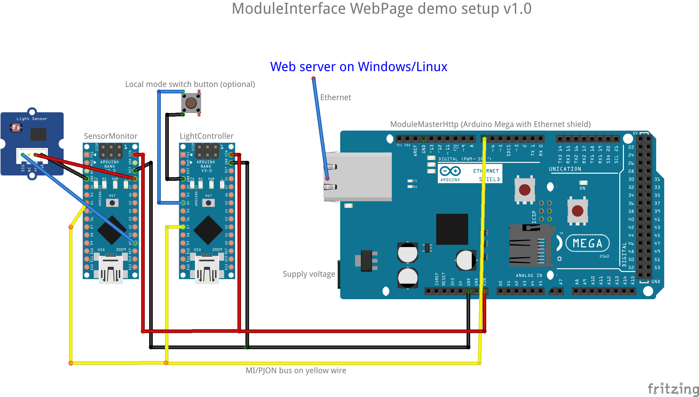
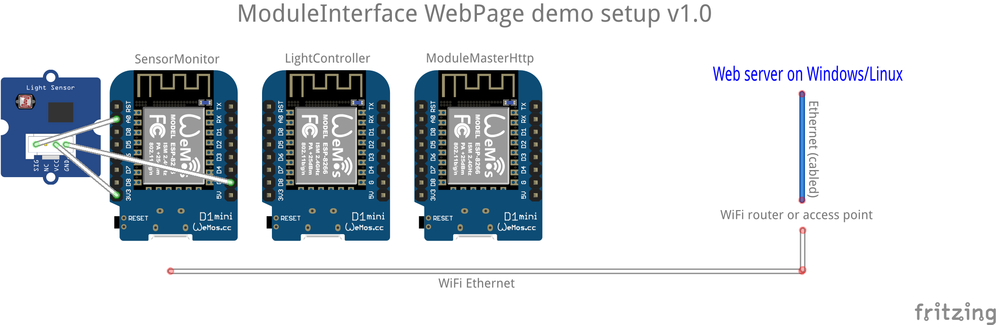

# WebPage example
This is not a single sketch, but a recipe of how to set up a complete setup with two modules being visualized and controlled from a web page. It shall be easy to add more modules to this setup.

A "module" is simply a device like Arduino Nano equipped with necessary equipment like sensors, servos, relays etc, programmed with a sketch that communicates with a ModuleInterface master. It can also be a process running on a Linux or Windows based computer.

## Arduino based setup

The modules and master for this setup can be found in the ARDUINO_SWBB folder.

### Components
1. A SensorMonitor module, for example running on an Arduino Uno or Nano. This module simply reads a light sensor and reports it to the master.
2. A LightController module, for example running on an Arduino Uno or Nano. This module subscribes to the light sensor reading from the SensorMonitor, and gets settings like time interval and light limit from the Master for controlling the light. In this example it only controls the on-board LED. It reports the current light state (or or off) to the master.
3. A ModuleMasterHttp module running on an Arduino Mega (because of memory requirements) with an Ethernet shield. This will transfer settings to and from the database and outputs to the database using JSON and HTTP requests.
4. A computer with a LAMP or WAMP setup. For example by following a tutorial like [this](https://www.digitalocean.com/community/tutorials/how-to-install-linux-apache-mysql-php-lamp-stack-on-ubuntu-16-04) for Linux, or using  a distro like [XAMPP](https://www.apachefriends.org/download.html) or [WampServer](http://www.wampserver.com/en/) for Windows.

Have a look at the chapter "How to build the setup" further down to be able to build and verify the setup in stages.


Arduino-based setup using PJON SWBB (SoftwareBitBang) on a single wire

## ESP8266 based setup

The modules and master for ESP8266 can be found in the ESP8266_GUDP folder. This has been tested on NodeMCU devices. The setup uses the PJON GlobalUDP strategy over WiFi, but could just as well run SWBB with a wire between the devices and WiFi only to the web server.


ESP8266-based setup using PJON GUDP (GlobalUDP) over WiFi


## ModuleMasterHttp on Windows, Linux or Raspberry

As an alternative to having the ModuleMasterHttp on an Arduino Mega, it can be run on a computer, for example along with the web server. The master will communicate via Ethernet with the modules through some kind of bridge.

If the master and the modules are connected through a LAN, the easiest solution is to let the master connect to a [Switch](https://github.com/gioblu/PJON/blob/master/examples/ARDUINO/Local/SoftwareBitBang/Tunneler/BlinkingRGBSwitch/BlinkingRGBSwitch.ino) using the LocalUDP strategy. This is efficient and requires little configuration. This version of the master is present in the WINDOWS_LINUX_LUDP directory. More switches can be added as the setup grows.

If master and modules must communicate over multiple network segments, not on a single LAN where the LocalUDP broadcast based strategy can be used, the master has to use another strategy. GlobalUDP is a relevant choice, but requires static IP addresses in all devices. If there is only one group of modules, the EthernetTCP strategy has a one-to-one mode that is very efficient for letting the master communicate as if it was actually part of the SWBB bus. A switch-like Arduino device named [Surrogate](https://github.com/gioblu/PJON/blob/master/examples/ARDUINO/Local/EthernetTCP/SoftwareBitBangSurrogate/Surrogate/Surrogate.ino) is connected to the SWBB bus and has a permanent TCP connection to the master, virtually placing the master "inside the SWBB bus". This version of the master is present in the WINDOWS_LINUX_ETCP directory. If using this, a Nano or Uno with an Ethernet shield can run the PJON Surrogate sketch and be the translator between Ethernet and SWBB. Only the master needs a fixed IP with this setup, and the Surrogate will "phone home". If there is a firewall between the modules and the master, only a one-way opening / port forwarding is needed.

## Pages
The web page example consists of a Dashboard that is meant to show key information from all modules in one place, plus one page per module. This is how it is meant to look:


This is how it will look when viewed on a narrow screen like a mobile phone:


## Configuration of SensorMonitor
Program a device with the SensorMonitor sketch. Connect the analog pin of a light sensor to pin A0 (plus ground and voltage to sensor, of course). Connect pin 7 to the PJON bus on pin 7 of the master. Connect device ground to ground on the master.

## Configuration of LightController
Program a device with the LightController sketch. Connect pin 7 to the PJON bus on pin 7 of the master. Connect device ground to ground on the master. If you want to test setting the controller mode with a local control and not only from the web page,
add a temporary push button between pin 4 and ground.

## Configuration of ModuleMasterHttp
 The master must have a correct network configuration for the network to which it is connected. This includes:
 - A unique MAC address, just fiddle with the MAC address in the sketch.
 - A unique IP address. The example use a fixed IP address for simplicity and to not be depending on a DHCP server being present. Make sure that the assigned IP address is outside any DHCP pool in your router if you want this as a permanent setup.
 - The IP of your gateway, normally the router address. This is not strictly needed if the web server is on the same network segment.
 - The network mask for your network. Normally the mask is 255.255.255.0.

The master must also know the IP address of your web server.

After modifying the network and IP addresses in the ModuleMasterHttp sketch, program a Mega with this.

Then add an Ethernet shield to the Mega, connect a CAT5 cable between the shield and your network switch or router, then power on.

## Installation of web server and database
Follow the recipe, or run the XAMPP or WampServer installation package. If you want a stable and uninterrupted system, use Linux or a server version of Windows to avoid the frequent updates and reboots of the desktop versions of Windows.

### Configuration of database
1. Start Apache and MySQL/MariaDb and open the phpMyAdmin page. Or use a similar tool, like HeidiSQL if you want to keep your htdocs directory clean from other stuff. If you use the XAMPP distro, you can start phpMyAdmin by opening ```http://localhost/applications.html``` in the browser and clicking phpMyAdmin on the top right.
2. Go to the Import tab and run the "database setup/home_control.sql" file to create the required tables. The character set must be set to UTF-8.
3. You now have the home_control database running. Data should be updated in the currentvalues table after a short while, and you can inspect this (in phpMyAdmin by clicking on the table name to refresh the data).

### Configuration of web server
1. The files from the "htdocs" folder are copied into the "C:/xampp/htdocs" folder (depending on installation). Unfortunately, XAMPP has a lot of files present here to supply phpMyAdmin etc, so it will be a mix. Some Other WAMP/LAMP distros keep the htdocs directory empty and supply database management tools like the native program HeidiSQL. A LAMP setup on Linux may use /var/www/html, so this is where you should put the files in this case.
2. The db_config.php file edited to contain the selected database name, user name and password. Initially the password will be empty, so get it working before setting a password (unless you did set a password during installation).

## How to build the setup

Building the worker modules and the master, and installing and configuring both a database and a web server, then connecting it all together and expecting it to work out of the box, untested, is a little optimistic.

To build and test the setup in stages from the bottom up, there are test masters present that are meant to verify a stage before building more on top. The suggested stages can be used to  for a setup with Arduino modules. The second step is relevant when the master is running on Linux/Windows and not on an Arduino:

1. Build the ARDUINO_SWBB modules SensorMonitor and LightController and TestModuleMaster. Connect them to common ground, then connect pin 7 on all of them together to form a PJON SWBB bus. The TestModuleMaster will print the light level measured by SensorMonitor and the current LED state from the LightController to the serial line, easily inspected with the Arduino Studio serial monitor. Try to use a flashlight to change the light above the on/off threshold of 200 hardcoded in the test master, and see the LED of the LightController go on when it gets darker and off when it gets lighter. If this works, then the SensorMonitor and LightController are tested and should be left unchanged, and the TestModuleMaster should be replaced with a device with an Ethernet shield and software for a [LUDP-SWBB Switch](https://github.com/gioblu/PJON/blob/master/examples/ARDUINO/Local/SoftwareBitBang/Tunneler/BlinkingRGBSwitch/BlinkingRGBSwitch.ino). Using the switch with an RGB LED is recommended because it allows visual observation of packets passing through in each direction or not being delivered.
2. Build the WINDOWS_LINUX_LUDP/TestModuleMaster and run it on a computer connected to the same LAN as the switch connected to the SWBB bus. This test master does not communicate with the web server but has static settings just like the first TestModuleMaster. It is simply meant to verify that a process on the computer can communicate with the modules on the SWBB bus through the switch. Inspect the output from the TestModuleMaster in the console window in which it is run to see light measurement and current LED state. See packets passing through the switch by the green and blue blinks, and make sure there are no red blinks. If this works fine, you have verified everything except the database and web page setup. The TestModuleMaster program should be stopped, and the WINDOWS_LINUX_LUDP/ModuleMasterHttp program should be built and started to run the complete setup with the database and web pages.

## Testing
When all is up and running, check this:
1. Are values updated in the currentvalues table?
2. Are new rows being created in the timeseries table? You can inspect the table with HeidiSQL or phpMyAdmin.
3. Are you getting the values shown in the plot in the web page?
4. Can you change the LightController mode (on/off/auto) and see the on-board LED reflect this after a few seconds?
5. Can you push the mode switch button of the LightController module and see this reflected in the on-board LED,
and also see it updated in the web page after some seconds? (The web page updates values every 5 seconds.)

## Debugging
If it does not work right away, you can try the following steps.
1. Try to manually get settings from the database by inputting the following in the address field of a browser on the web server:
   ```http://localhost/get_settings.php```
   You should see a JSON string with all available settings. If not, web server and database setup must be checked. You should get an error message in the browser. Try to use this to find out what is wrong. Check db_config.php.
2. Try to manually get current values from the database by inputting the following in the address field of a browser:
      ```http://localhost/get_currentvalues.php```
   You should see a JSON string with all current values. If not, use another tool like HeidiSql for checking if rows have been created in the currentvalues table (most relevant if you have added new modules or more variables). But you should get a nice JSON response with names and values.
3. If manual tests succeed but there are no values delivered from the master, re-check the master device IP settings and try programming the master again, and check all connections.
4. Run a scan and see if the ModuleMasterHttp is present in your network. A simple way to do this is to run the free app "Fing" on an Android phone or tablet. You should see the IP address you assigned to your master present in the Fing list.

## Credits
The web page example is based on the following:
* [Bootstrap](https://getbootstrap.com/) (MIT license)
* [Chart.js](http://www.chartjs.org/) for live plots on the dashboard page (MIT license)
* [d3](https://github.com/d3/d3/wiki/gallery) (BSD-3 license)
* [dygraphs](http://dygraphs.com/) for charts on the module pages (MIT license)
* [jQuery](https://jquery.com/) (MIT license plus referencing ```https://jquery.org/license```)
* [font-awesome](http://fontawesome.io/) (SIL OFL 1.1 license)
* [templatemo](http://www.templatemo.com/) for the starting point (Creative Commons 4.0 International license)
